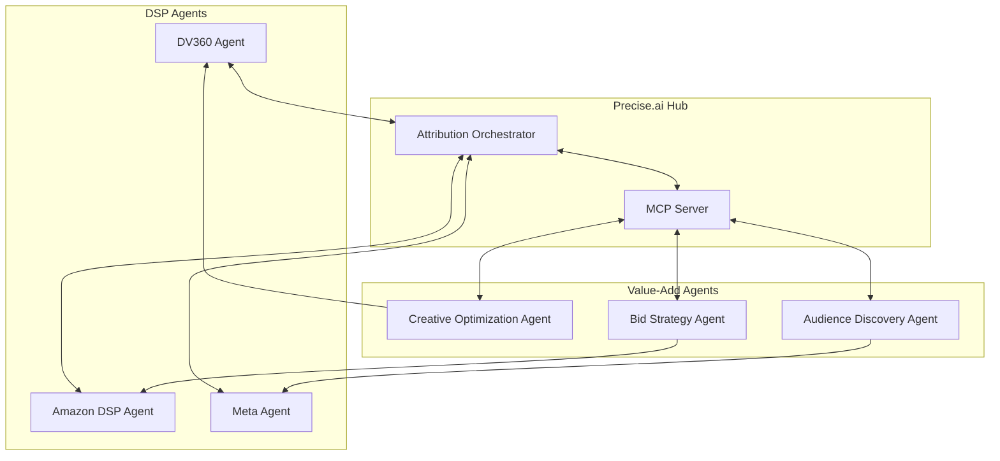

# Agent Architecture Patterns for Precise.ai

## A2A (Agent-to-Agent) Communication

### Pattern 1: Federated Attribution Network



### Pattern 2: MCP-Enabled Agent Ecosystem

```python
# MCP Server Configuration for Precise.ai
{
  "mcpServers": {
    "precise-attribution": {
      "command": "npx",
      "args": ["@precise-ai/mcp-server"],
      "env": {
        "PRECISE_API_KEY": "{{PRECISE_API_KEY}}"
      }
    }
  }
}
```

## High-Value Agents Precise Could Surface Today

### 1. Creative Fatigue Prediction Agent

**What DSPs Need**: Real-time creative performance predictions
**What Precise Provides**: Cross-platform fatigue signals

```python
class CreativeFatigueAgent:
    """
    Surfaces to DSPs via MCP/A2A when creatives need rotation
    """
    
    async def get_fatigue_predictions(self, dsp_context):
        """
        MCP Tool: precise_creative_fatigue
        Returns fatigue scores and recommended actions
        """
        return {
            "creative_id": dsp_context.creative_id,
            "fatigue_score": 8.5,
            "days_until_critical": 3,
            "recommended_action": "prepare_replacement",
            "cross_platform_insights": {
                "performing_better_on": ["Meta", "TikTok"],
                "performing_worse_on": ["DV360", "Amazon"]
            },
            "suggested_variants": [
                {
                    "change_type": "color_scheme",
                    "predicted_lift": 0.15
                },
                {
                    "change_type": "cta_text", 
                    "predicted_lift": 0.22
                }
            ]
        }
```

### 2. Incrementality-Adjusted Bidding Agent

**What DSPs Need**: True incremental value per impression
**What Precise Provides**: Multi-touch attribution intelligence

```python
class IncrementalityBiddingAgent:
    """
    Real-time bid adjustments based on true incremental value
    """
    
    @mcp_tool("get_incremental_bid_modifier")
    async def calculate_bid_adjustment(self, impression_context):
        # Precise has visibility across all touchpoints
        user_journey = await self.get_user_journey(impression_context.user_id)
        
        return {
            "bid_modifier": self.calculate_incremental_value(user_journey),
            "confidence": 0.89,
            "reasoning": {
                "prior_touchpoints": len(user_journey.touchpoints),
                "diminishing_returns_factor": 0.7,
                "channel_saturation": self.get_saturation_score(user_journey)
            },
            "recommended_bid": impression_context.base_bid * bid_modifier
        }
```

### 3. Audience Arbitrage Agent

**What DSPs Need**: Find undervalued audiences
**What Precise Provides**: Cross-DSP pricing intelligence

```python
class AudienceArbitrageAgent:
    """
    Identifies audience segments that are underpriced on specific DSPs
    """
    
    @mcp_tool("find_arbitrage_opportunities")
    async def get_arbitrage_opportunities(self, campaign_goals):
        # Precise sees pricing across all platforms
        opportunities = []
        
        for segment in self.get_relevant_segments(campaign_goals):
            pricing = await self.get_cross_dsp_pricing(segment)
            
            if pricing.has_arbitrage_opportunity():
                opportunities.append({
                    "segment": segment.name,
                    "best_dsp": pricing.lowest_cost_dsp,
                    "savings_potential": pricing.arbitrage_percentage,
                    "quality_score": segment.precise_quality_score,
                    "recommended_budget_shift": pricing.optimal_allocation
                })
                
        return sorted(opportunities, key=lambda x: x['savings_potential'])
```

### 4. Supply Path Optimization Agent

**What DSPs Need**: Optimal path to quality inventory
**What Precise Provides**: Performance data across supply paths

```python
class SupplyPathAgent:
    """
    Recommends optimal SSP/Exchange paths based on actual performance
    """
    
    @a2a_endpoint("/optimize_supply_path")
    async def optimize_supply_path(self, campaign_id, target_domain):
        # Analyze performance across different paths
        paths = await self.analyze_supply_paths(campaign_id, target_domain)
        
        return {
            "recommended_path": {
                "ssp": "Pubmatic",
                "deal_id": "PM_DIRECT_123",
                "predicted_viewability": 0.78,
                "predicted_ctr": 0.023,
                "cost_efficiency": 1.34  # 34% more efficient
            },
            "alternative_paths": [...],
            "avoid_paths": [
                {
                    "ssp": "OpenX",
                    "reason": "High invalid traffic rate",
                    "evidence": "15% IVT over last 30 days"
                }
            ]
        }
```

### 5. Real-Time MMM Insights Agent

**What DSPs Need**: Immediate attribution feedback
**What Precise Provides**: Instant MMM calculations

```python
class RealTimeMMAgent:
    """
    Provides instant Marketing Mix Model insights for bid decisions
    """
    
    @mcp_server_function
    async def get_channel_contribution(self, impression_opportunity):
        # Real-time MMM calculation
        current_mix = await self.get_current_channel_mix(
            impression_opportunity.campaign_id
        )
        
        marginal_contribution = self.calculate_marginal_contribution(
            current_mix,
            impression_opportunity.channel,
            impression_opportunity.estimated_impact
        )
        
        return {
            "current_channel_contribution": 0.23,
            "marginal_contribution": marginal_contribution,
            "saturation_level": self.get_saturation(current_mix),
            "recommended_action": "bid" if marginal_contribution > 0.1 else "skip",
            "optimal_channel_mix_distance": self.distance_from_optimal(current_mix)
        }
```

## Implementation Architecture

### MCP Server for Precise.ai

```javascript
// precise-mcp-server/index.js
import { MCPServer } from '@modelcontextprotocol/server';

const server = new MCPServer({
  name: 'precise-ai',
  version: '1.0.0',
  description: 'Real-time advertising intelligence'
});

// Register tools that DSP agents can use
server.tool('get_creative_fatigue', async (params) => {
  const response = await fetch('https://api.precise.ai/v1/creative/fatigue', {
    method: 'POST',
    headers: { 'Authorization': `Bearer ${process.env.API_KEY}` },
    body: JSON.stringify(params)
  });
  return response.json();
});

server.tool('get_attribution_insights', async (params) => {
  // Real-time attribution calculation
  return attributionEngine.calculate(params);
});

server.tool('optimize_audience_mix', async (params) => {
  // Cross-DSP audience optimization
  return audienceOptimizer.recommend(params);
});

server.start();
```

### A2A Communication Hub

```python
# Agent-to-Agent communication broker
class PreciseA2AHub:
    def __init__(self):
        self.registered_agents = {}
        self.message_queue = asyncio.Queue()
        
    async def register_agent(self, agent_id, capabilities, webhook_url):
        """DSP agents register their capabilities"""
        self.registered_agents[agent_id] = {
            'capabilities': capabilities,
            'webhook_url': webhook_url,
            'last_seen': datetime.utcnow()
        }
        
    async def broadcast_insight(self, insight_type, data):
        """Broadcast insights to relevant agents"""
        relevant_agents = self.find_interested_agents(insight_type)
        
        for agent in relevant_agents:
            await self.send_to_agent(agent, {
                'type': insight_type,
                'data': data,
                'timestamp': datetime.utcnow().isoformat()
            })
            
    async def request_collaboration(self, requesting_agent, capability_needed):
        """Enable agent-to-agent collaboration"""
        capable_agents = self.find_capable_agents(capability_needed)
        return await self.mediate_collaboration(requesting_agent, capable_agents)
```

## Value Propositions for DSPs

### 1. **Unified Intelligence Layer**
- Single integration point for multi-DSP intelligence
- No need to build attribution separately
- Instant access to cross-platform insights

### 2. **Real-Time Optimization**
- Microsecond-level bid guidance
- Immediate fatigue detection
- Dynamic budget reallocation

### 3. **Competitive Advantage**
- See what others can't (cross-DSP view)
- Predictive insights vs reactive reporting
- True incrementality measurement

### 4. **Operational Efficiency**
- Automated creative rotation
- Proactive budget management
- Supply path optimization

## Quick Start for DSPs

```bash
# 1. Install Precise.ai MCP Server
npm install -g @precise-ai/mcp-server

# 2. Configure your DSP agent
cat > .precise-config.json << EOF
{
  "api_key": "YOUR_API_KEY",
  "dsp": "DV360",
  "capabilities": ["bidding", "creative_optimization", "audience_targeting"],
  "webhook_url": "https://your-dsp.com/webhooks/precise"
}
EOF

# 3. Start receiving intelligence
precise-mcp-server start --config .precise-config.json
```

## Next-Gen Agent Patterns

### 1. **Swarm Intelligence**
Multiple specialized agents working together:
- Creative agents share performance data
- Bidding agents coordinate to avoid competition
- Attribution agents provide unified view

### 2. **Predictive Orchestration**
- Agents anticipate needs before they arise
- Pre-position budgets based on predicted performance
- Queue creative variants before fatigue hits

### 3. **Adversarial Validation**
- Agents challenge each other's recommendations
- Built-in skepticism for better decisions
- Continuous improvement through competition

This architecture positions Precise.ai as the intelligence layer that makes all DSPs smarter, not just another reporting tool.