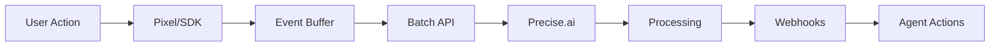
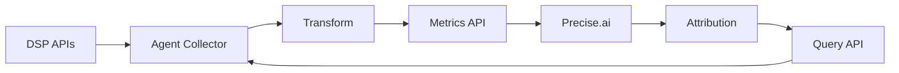

# Agent System Integration Guide

This guide explains how to build agent systems that integrate with Precise.ai's APIs to automate data collection, monitoring, and optimization.

## Overview

Agent systems are automated programs that run on your infrastructure and:
- Collect data from your DSPs, ad servers, and analytics platforms
- Push data to Precise.ai via our APIs
- React to webhooks for real-time optimization
- Maintain data quality and freshness

## Architecture Patterns

### 1. DSP Integration Agent

```python
# Example: Google DV360 Integration Agent

import asyncio
import aiohttp
from datetime import datetime, timedelta
import os
from typing import Dict, List

class DV360Agent:
    def __init__(self):
        self.precise_api_key = os.environ['PRECISE_API_KEY']
        self.dv360_credentials = os.environ['DV360_CREDENTIALS']
        self.precise_base_url = 'https://api.precise.ai/v1'
        self.batch_size = 500
        
    async def run(self):
        """Main agent loop - runs every 5 minutes"""
        while True:
            try:
                await self.sync_campaigns()
                await self.sync_performance_metrics()
                await self.check_alerts()
                await asyncio.sleep(300)  # 5 minutes
            except Exception as e:
                print(f"Agent error: {e}")
                await asyncio.sleep(60)  # Retry after 1 minute
                
    async def sync_campaigns(self):
        """Sync campaign metadata from DV360"""
        # Fetch campaigns from DV360 API
        campaigns = await self.fetch_dv360_campaigns()
        
        # Transform to Precise.ai format
        for campaign in campaigns:
            metrics = {
                'campaign_id': f"dv360_{campaign['id']}",
                'timestamp': datetime.utcnow().isoformat(),
                'metrics': {
                    'budget': campaign['budget'],
                    'spend': campaign['spend'],
                    'status': campaign['status']
                }
            }
            
            # Push to Precise.ai
            await self.push_metrics(metrics)
            
    async def sync_performance_metrics(self):
        """Sync detailed performance data"""
        # Get active campaigns
        campaigns = await self.get_active_campaigns()
        
        # Collect events in batches
        events = []
        for campaign in campaigns:
            # Fetch impressions, clicks, conversions from DV360
            perf_data = await self.fetch_dv360_performance(campaign['id'])
            
            for record in perf_data:
                events.append({
                    'event_type': record['type'],  # impression, click, conversion
                    'entity_type': 'campaign',
                    'entity_id': f"dv360_{campaign['id']}",
                    'properties': {
                        'dsp': 'DV360',
                        'creative_id': record['creative_id'],
                        'cost': record['cost'],
                        'timestamp': record['timestamp'],
                        'user_segments': record['audiences'],
                        'geo': record['geo_data']
                    }
                })
                
                # Send batch when full
                if len(events) >= self.batch_size:
                    await self.push_events_batch(events)
                    events = []
                    
        # Send remaining events
        if events:
            await self.push_events_batch(events)
            
    async def push_metrics(self, metrics: Dict):
        """Push metrics to Precise.ai"""
        async with aiohttp.ClientSession() as session:
            async with session.post(
                f"{self.precise_base_url}/metrics",
                json=metrics,
                headers={
                    'Authorization': f'Bearer {self.precise_api_key}',
                    'Content-Type': 'application/json'
                }
            ) as response:
                if response.status != 201:
                    error = await response.json()
                    print(f"Failed to push metrics: {error}")
                    
    async def push_events_batch(self, events: List[Dict]):
        """Push batch of events to Precise.ai"""
        async with aiohttp.ClientSession() as session:
            async with session.post(
                f"{self.precise_base_url}/events/batch",
                json={'events': events},
                headers={
                    'Authorization': f'Bearer {self.precise_api_key}',
                    'Content-Type': 'application/json'
                }
            ) as response:
                if response.status != 201:
                    error = await response.json()
                    print(f"Failed to push events: {error}")

if __name__ == '__main__':
    agent = DV360Agent()
    asyncio.run(agent.run())
```

### 2. Pixel/Tag Agent

```javascript
// Example: Browser-based pixel agent for real-time tracking

class PrecisePixelAgent {
  constructor(config) {
    this.apiKey = config.apiKey;
    this.campaignId = config.campaignId;
    this.endpoint = 'https://api.precise.ai/v1/events/batch';
    this.buffer = [];
    this.bufferSize = 50;
    this.flushInterval = 3000; // 3 seconds
    
    // Start flush timer
    setInterval(() => this.flush(), this.flushInterval);
    
    // Listen for page events
    this.setupEventListeners();
  }
  
  setupEventListeners() {
    // Track page views
    this.track('impression', {
      url: window.location.href,
      referrer: document.referrer,
      timestamp: new Date().toISOString()
    });
    
    // Track clicks
    document.addEventListener('click', (e) => {
      if (e.target.matches('[data-track]')) {
        this.track('click', {
          element: e.target.dataset.track,
          url: window.location.href,
          timestamp: new Date().toISOString()
        });
      }
    });
    
    // Track conversions
    window.addEventListener('conversion', (e) => {
      this.track('conversion', {
        ...e.detail,
        timestamp: new Date().toISOString()
      });
    });
  }
  
  track(eventType, properties) {
    this.buffer.push({
      event_type: eventType,
      entity_type: 'campaign',
      entity_id: this.campaignId,
      properties: {
        ...properties,
        session_id: this.getSessionId(),
        user_agent: navigator.userAgent,
        viewport: {
          width: window.innerWidth,
          height: window.innerHeight
        }
      }
    });
    
    // Flush if buffer is full
    if (this.buffer.length >= this.bufferSize) {
      this.flush();
    }
  }
  
  async flush() {
    if (this.buffer.length === 0) return;
    
    const events = [...this.buffer];
    this.buffer = [];
    
    try {
      const response = await fetch(this.endpoint, {
        method: 'POST',
        headers: {
          'Authorization': `Bearer ${this.apiKey}`,
          'Content-Type': 'application/json'
        },
        body: JSON.stringify({ events })
      });
      
      if (!response.ok) {
        // Re-add events on failure
        this.buffer = [...events, ...this.buffer];
      }
    } catch (error) {
      console.error('Failed to send events:', error);
      this.buffer = [...events, ...this.buffer];
    }
  }
  
  getSessionId() {
    // Implementation for session tracking
    return sessionStorage.getItem('precise_session_id') || this.generateSessionId();
  }
  
  generateSessionId() {
    const id = Math.random().toString(36).substring(2);
    sessionStorage.setItem('precise_session_id', id);
    return id;
  }
}
```

### 3. Webhook Handler Agent

```python
# Example: Webhook handler for real-time optimization

from flask import Flask, request, jsonify
import hmac
import hashlib
import requests
import os

app = Flask(__name__)

WEBHOOK_SECRET = os.environ['PRECISE_WEBHOOK_SECRET']
DSP_API_ENDPOINTS = {
    'DV360': 'https://displayvideo.googleapis.com/v1',
    'Amazon': 'https://advertising-api.amazon.com',
    'Meta': 'https://graph.facebook.com/v15.0'
}

@app.route('/webhooks/precise', methods=['POST'])
def handle_webhook():
    # Verify webhook signature
    signature = request.headers.get('X-Precise-Signature')
    if not verify_signature(request.data, signature):
        return jsonify({'error': 'Invalid signature'}), 401
        
    # Parse webhook data
    data = request.json
    event_type = data['event']
    event_data = data['data']
    
    # Route to appropriate handler
    if event_type == 'creative.fatigue_detected':
        handle_creative_fatigue(event_data)
    elif event_type == 'campaign.budget_exceeded':
        handle_budget_exceeded(event_data)
    elif event_type == 'attribution.model_updated':
        handle_attribution_update(event_data)
        
    return jsonify({'status': 'processed'}), 200

def verify_signature(payload, signature):
    expected = hmac.new(
        WEBHOOK_SECRET.encode(),
        payload,
        hashlib.sha256
    ).hexdigest()
    return hmac.compare_digest(expected, signature)

def handle_creative_fatigue(data):
    """Auto-pause fatigued creatives and notify team"""
    campaign_id = data['campaign_id']
    creative_id = data['creative_id']
    fatigue_score = data['fatigue_score']
    
    if fatigue_score > 8:
        # Pause creative in DSP
        pause_creative_in_dsp(campaign_id, creative_id)
        
        # Notify creative team
        send_slack_notification(
            f"Creative {creative_id} has fatigue score {fatigue_score}. "
            f"Auto-paused. Please provide replacement."
        )

def handle_budget_exceeded(data):
    """Auto-pause campaigns that exceed budget"""
    campaign_id = data['campaign_id']
    overage = data['overage_percentage']
    
    if overage > 5:  # More than 5% over budget
        # Pause campaign immediately
        pause_campaign_in_dsp(campaign_id)
        
        # Notify finance team
        send_email_alert(
            to='finance@company.com',
            subject=f'Campaign {campaign_id} exceeded budget by {overage}%',
            body=data
        )

def handle_attribution_update(data):
    """Reallocate budget based on new attribution insights"""
    campaign_id = data['campaign_id']
    touchpoints = data['touchpoints']
    
    # Calculate optimal budget allocation
    total_budget = get_campaign_budget(campaign_id)
    
    for touchpoint in touchpoints:
        channel = touchpoint['channel']
        contribution = touchpoint['contribution']
        new_budget = total_budget * contribution
        
        # Update channel budget in DSP
        update_channel_budget(campaign_id, channel, new_budget)

if __name__ == '__main__':
    app.run(host='0.0.0.0', port=5000)
```

## Data Flow Patterns

### 1. Real-Time Event Streaming



### 2. Periodic Sync Pattern



## Best Practices

### 1. Error Handling

```python
import backoff
import logging

class RobustAgent:
    @backoff.on_exception(
        backoff.expo,
        requests.exceptions.RequestException,
        max_tries=5
    )
    async def push_data(self, data):
        """Push data with exponential backoff retry"""
        response = await self.session.post(
            self.api_endpoint,
            json=data,
            headers=self.headers
        )
        response.raise_for_status()
        return response.json()
        
    async def safe_push(self, data):
        """Push with fallback to local storage"""
        try:
            return await self.push_data(data)
        except Exception as e:
            logging.error(f"Failed to push data: {e}")
            await self.store_locally(data)
            return None
```

### 2. Data Validation

```python
from pydantic import BaseModel, validator
from typing import List, Optional

class EventData(BaseModel):
    event_type: str
    entity_type: str
    entity_id: str
    properties: dict
    
    @validator('event_type')
    def valid_event_type(cls, v):
        allowed = ['impression', 'click', 'conversion']
        if v not in allowed:
            raise ValueError(f'Must be one of: {allowed}')
        return v
        
    @validator('entity_id')
    def valid_uuid(cls, v):
        # Validate UUID format
        import uuid
        try:
            uuid.UUID(v)
        except ValueError:
            raise ValueError('Invalid UUID format')
        return v
```

### 3. Monitoring & Alerting

```python
class MonitoredAgent:
    def __init__(self):
        self.metrics = {
            'events_sent': 0,
            'events_failed': 0,
            'last_sync': None,
            'api_errors': {}
        }
        
    async def run_with_monitoring(self):
        """Run agent with health checks"""
        while True:
            try:
                await self.sync_data()
                self.metrics['last_sync'] = datetime.utcnow()
                
                # Health check
                if self.metrics['events_failed'] > 100:
                    await self.alert_ops_team()
                    
            except Exception as e:
                self.metrics['api_errors'][str(e)] = \
                    self.metrics['api_errors'].get(str(e), 0) + 1
                    
            # Expose metrics endpoint
            await self.update_metrics_endpoint()
            await asyncio.sleep(300)
```

## Security Considerations

1. **API Key Management**
   - Store API keys in environment variables or secret management systems
   - Rotate keys regularly
   - Use separate keys for different environments

2. **Data Privacy**
   - Hash or encrypt PII before sending
   - Respect user consent and privacy settings
   - Implement data retention policies

3. **Network Security**
   - Always use HTTPS
   - Implement request signing for critical operations
   - Use IP allowlisting where possible

## Testing Your Integration

```python
# Integration test example
import pytest
from unittest.mock import Mock, patch

class TestPreciseIntegration:
    @pytest.fixture
    def agent(self):
        return MyPreciseAgent(api_key='test_key')
        
    @patch('requests.post')
    def test_event_push(self, mock_post, agent):
        # Mock successful response
        mock_post.return_value.status_code = 201
        mock_post.return_value.json.return_value = {'id': '123'}
        
        # Test event push
        result = agent.push_event({
            'event_type': 'impression',
            'entity_type': 'campaign',
            'entity_id': 'camp_123',
            'properties': {}
        })
        
        assert result['id'] == '123'
        mock_post.assert_called_once()
        
    def test_webhook_signature(self, agent):
        payload = b'{"event": "test"}'
        secret = 'test_secret'
        signature = agent.generate_signature(payload, secret)
        
        assert agent.verify_signature(payload, signature, secret)
```

## Support Resources

- API Status: https://status.precise.ai
- Developer Forum: https://developers.precise.ai/forum
- Example Agents: https://github.com/precise-ai/agent-examples
- Support Email: integrations@precise.ai

## Next Steps

1. **Get API Keys**: Sign up at https://app.precise.ai/settings/api-keys
2. **Install SDK**: `pip install precise-ai` or `npm install @precise-ai/sdk`
3. **Deploy Agent**: Start with our example agents and customize for your needs
4. **Monitor Performance**: Use our dashboard to track agent health
5. **Optimize**: Use webhook feedback to improve your integration